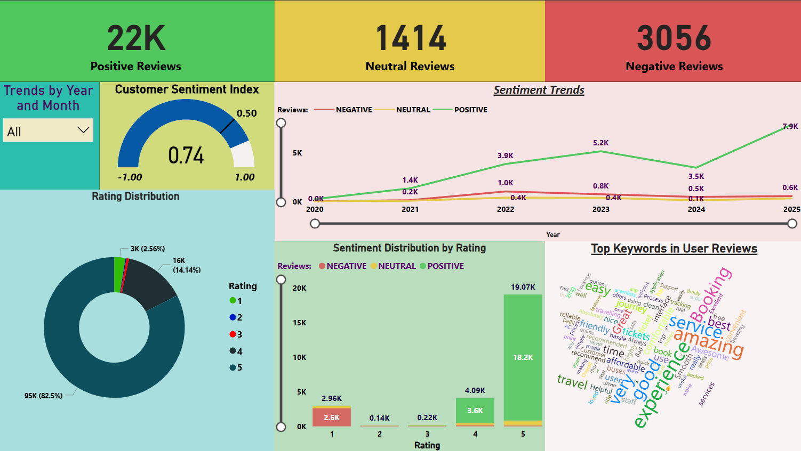
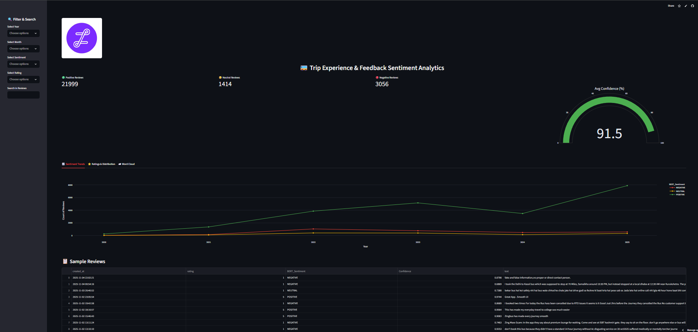

<div align="center">
  
  <h1>🚌 Trip Experience & Feedback Sentiment Analytics</h1>
  <p><b>BERT-powered NLP + Power BI + Streamlit Interactive Dashboards</b></p>

  [](https://tripsentimentanalytics-egepmqx53f9nhaeed4qzok.streamlit.app/)
  [](https://app.powerbi.com/view?r=eyJrIjoiMWQwM2U1ODMtMTU3YS00NGZjLTk2NWQtNzBlNzY0OWJkOTBjIiwidCI6ImUxNGU3M2ViLTUyNTEtNDM4OC04ZDY3LThmOWYyZTJkNWE0NiIsImMiOjEwfQ%3D%3D&pageName=5868ca4616f39565b88f)
  [](https://github.com/Aditya-227/Trip_Sentiment_Analytics)
</div>

---


---

### 🎯 **Project Overview**

The **Trip Sentiment & Feedback Analytics** project combines **Natural Language Processing (NLP)** and **Business Intelligence (BI)** to extract actionable insights from 50K+ passenger reviews for the **Zingbus travel platform**.

It features two complementary dashboards:
- 🌐 **Streamlit App:** Interactive NLP-based dashboard with real-time review filtering and visualization.  
- 📊 **Power BI Dashboard:** Executive overview for data-driven service improvement and trend analysis.

---

### 🧠 **Key Features**

#### 🧩 Data Science & NLP (Streamlit)
- Sentiment analysis using **RoBERTa (BERT variant)** + **VADER**
- Multi-source data from **Google Play**, **Twitter**, and surveys
- Clean visual storytelling with **Plotly**, **WordCloud**, and KPIs
- Confidence gauge and keyword search functionality
- Download filtered data as `.csv`

#### 📈 Business Intelligence (Power BI)
- Route and driver sentiment analysis  
- KPI cards: % Positive / % Negative / % Neutral  
- Route-wise trend charts, heatmaps, and keyword insights  
- Automated weekly pain point summary  

---

### 🧰 **Tech Stack**

| Category | Tools Used |
|-----------|-------------|
| **Languages** | Python |
| **Libraries** | Streamlit, Pandas, Plotly, Matplotlib, WordCloud |
| **NLP Models** | RoBERTa (Hugging Face), VADER |
| **Visualization** | Power BI, Streamlit |
| **Hosting** | Streamlit Cloud |
| **Data Source** | Google Play Store Reviews (Zingbus App) |

---

### 🔗 **Live Dashboards**

| Platform | Link |
|-----------|------|
| 🌐 **Streamlit Dashboard** | [View Live App](https://tripsentimentanalytics-egepmqx53f9nhaeed4qzok.streamlit.app/) |
| 📊 **Power BI Dashboard** | [View Power BI Dashboard](https://app.powerbi.com/view?r=eyJrIjoiMWQwM2U1ODMtMTU3YS00NGZjLTk2NWQtNzBlNzY0OWJkOTBjIiwidCI6ImUxNGU3M2ViLTUyNTEtNDM4OC04ZDY3LThmOWYyZTJkNWE0NiIsImMiOjEwfQ%3D%3D&pageName=5868ca4616f39565b88f) |

---

### 📊 **Dashboard Preview**

| Overview | Word Cloud |
|-----------|------------|
|  |  |


---

### ⚙️ **Setup Instructions**

#### 🧩 Clone the Repository
```bash
git clone https://github.com/Aditya-227/Trip_Sentiment_Analytics.git
cd Trip_Sentiment_Analytics
